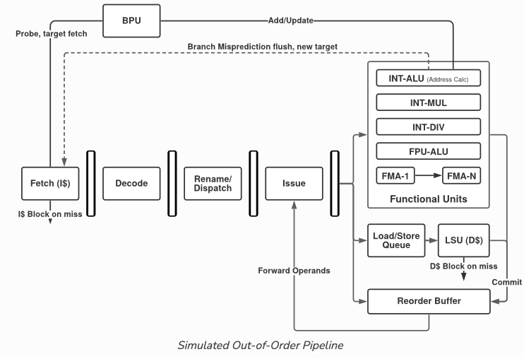
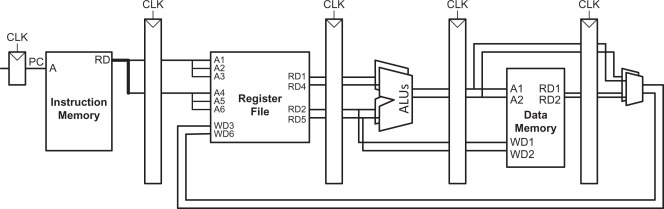

# Architecture Simulator — Multi-ISA CPU Simulator & C Compiler

A pure-Python, **zero-dependency core** CPU simulator that shows how source code
becomes machine code and how that code actually executes on hardware. It pairs a
**from-scratch retargetable C compiler** with a **cycle-accurate microarchitecture
simulator** and an interactive web UI that renders the datapath, registers, and
memory **one clock at a time**.

It models **18 configurations**: **3 real ISAs** — RISC-V RV32I, ARM AArch64,
x86 IA-32 — × **6 execution models** — single-cycle, multicycle, configurable
(per-class cycle budgets), 5-stage pipeline, out-of-order Tomasulo, and N-wide
superscalar. All three ISAs use **real instruction encodings**.



## Highlights

- **Cycle-accurate microarchitecture simulator** built on a custom Port / Wire /
  clocked-component framework. Reusable hardware blocks (fetch, decode, regfile,
  ALU, branch, memory, writeback, pipeline registers, ROB / reservation stations /
  register-alias table) are wired into a CPU via a fluent builder that advances
  one clock per tick and emits a per-cycle state snapshot.
- **Out-of-order execution** implements Tomasulo with a reorder buffer,
  reservation stations, and register renaming; the **superscalar** model is
  N-wide with multi-port memory so independent memory ops scale with lane width.
- **Retargetable C compiler** (`sim/compiler/`): a from-scratch lexer → parser →
  AST → per-ISA code generator with **three backends** (RISC-V, ARM, x86) that
  emit the simulator's own real machine code. Supports functions and recursion,
  arrays and pointers, globals, and full expression / control-flow lowering.
- **Real assemblers** (`sim/assembler/`): two-pass per-ISA assemblers producing
  real encodings, including x86 variable-length byte encoding with automatic
  short/near branch relaxation.
- **Interactive web UI**: a live SVG block diagram of the datapath plus register
  and memory views, scrubbable cycle by cycle. A **Program Lab** provides
  source-level stepping (into / over / out), breakpoints on C lines, a call-stack
  breadcrumb, and a `print()` console — showing exactly how compiled C flows
  through the pipeline.
- **Cross-model "Compile & Race"** grid: cycles-to-completion for the same
  program across every ISA and execution model, parity-checked against a
  single-cycle oracle.
- **~1,600+ test suite** enforcing cross-model correctness — every model's
  committed register and memory state is validated against the single-cycle
  oracle for all three ISAs.



## Quickstart

The core simulator needs nothing but Python 3; Flask is only for the web UI/API.

```bash
pip install -r requirements.txt      # flask, flask-cors (gunicorn for prod)

# Run the server -> http://127.0.0.1:5051   (appctl.py is the single entry point)
python3 appctl.py                    # == 'appctl.py run'; --host/--port/--debug

# Run the full test suite
python3 appctl.py test               # forwards args to pytest, e.g. '-k riscv'
```

Open <http://127.0.0.1:5051> for the simulator, or `/lab` for the Program Lab
(Core-C editor ↔ generated assembly ↔ live mini-CPU).

## Architecture

- **`sim/component/`** — the framework: `Port`/`ComponentBase` (declare I/O and
  combinational/clocked behavior), `Wire` (connect `src.port → dst.port`), and
  `CPUBuilder` (fluent `.add()/.wire()/.set_eval_order().build()`). `CPU.tick()`
  propagates wires, evaluates components in topological order, then clocks every
  component on the rising edge.
- **`sim/components/`** — shared hardware: ALU, branch (+ predictors), fetch,
  memory, regfile, writeback, pipeline registers, OoO (ROB/RS/RAT), superscalar,
  multicycle.
- **`sim/isa/<arch>/`** — per-ISA decoder, constants, config, and the six
  execution-model presets. The **decoder is the single hot-swap point** between
  ISAs: all three expose a common superset of control signals, so the execution
  models never change when the ISA does.
- **`sim/compiler/`** — the Core-C compiler (lexer, parser, AST, per-ISA codegen).
- **`sim/assembler/`** — per-ISA two-pass assemblers.
- **`api/app.py`** — the Flask app (routes + preset registry), launched by
  `appctl.py`.
- **`ui/`** — templates + `layout_engine.js` / `layouts/*.js` rendering the live
  block diagram with d3.

## Deployment

The repo ships a `render.yaml` for one-click deployment as a
[Render](https://render.com) web service (gunicorn serving `api.app:app`). Any
WSGI host works the same way.

## License

Personal project by [Blake Cragen](https://github.com/blakecragen).
